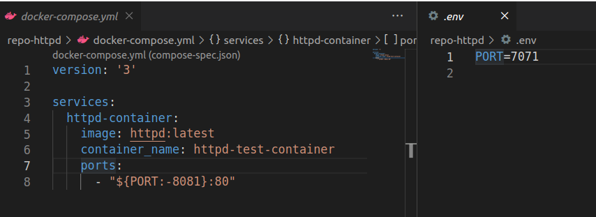
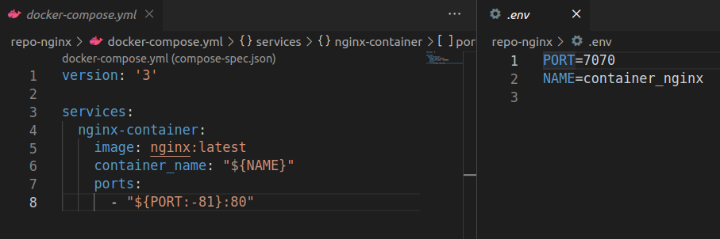

# repo-nginx

This repository is created for testing how docker-compose behaves while spinning up multiple compose files in a single repository and in the different repositories


## 1. How to set up?

For testing compose files in multiple repositories, it will need to download another testing repository `repo-httpd`

```
mkdir -p compose-test
git clone https://github.com/oscarzhou-portainer/repo-httpd.git
git clone https://github.com/oscarzhou-portainer/repo-nginx.git
```

After cloning both repositories, the file structure should look like  

```
├── repo-httpd
│   ├── docker-compose.yml
│   └── .env
└── repo-nginx
    ├── alpine
    │   ├── .env
    │   └── nginx-alpine.yml
    ├── docker-compose.yml
    └── .env
```

## 2. A glimpse of each compose and env file 

| File Path  | Compose File & .env file  |
|---|---|
| repo-httpd  |   |
| repo-nginx  |   |   
| repo-nginx/alpine  |   |   


## 3. Testing cases for a single repository

Let's start from multiple files in a single repository. Switching the current directory to `/repo-nginx`.

### 3.1. `docker compose -f ./docker-compose.yml -f ./alpine/nginx-alpine.yml convert`

Expect: Only `/repo-nginx/.env` file will be applied. 

Result:  

```
name: repo-nginx
services:
  nginx-alpine-container:
    container_name: container_nginx
    image: nginx/alpine:latest
    networks:
      default: null
    ports:
    - mode: ingress
      target: 80
      published: "7070"
      protocol: tcp
  nginx-container:
    container_name: container_nginx
    image: nginx:latest
    networks:
      default: null
    ports:
    - mode: ingress
      target: 80
      published: "7070"
      protocol: tcp
networks:
  default:
    name: repo-nginx_default
```

Both rendered configuration have the same port and contianer name as provided by `/repo-nginx/.env`. It's because docker-compose will pick up the .env file in the base path of the repository by default.

Both services are in the same network.

### 3.2. `docker compose --env-file=./.env -f ./docker-compose.yml --env-file=./alpine/.env -f ./alpine/nginx-alpine.yml convert`

Expect: Only `/repo-nginx/alpine/.env` file will be applied.  

Result: 

```
name: repo-nginx
services:
  nginx-alpine-container:
    container_name: container_nginx_alpine
    image: nginx/alpine:latest
    networks:
      default: null
    ports:
    - mode: ingress
      target: 80
      published: "7080"
      protocol: tcp
  nginx-container:
    container_name: container_nginx_alpine
    image: nginx:latest
    networks:
      default: null
    ports:
    - mode: ingress
      target: 80
      published: "7080"
      protocol: tcp
networks:
  default:
    name: repo-nginx_default
```

When multiple .env files are specified explicitly, only the last one will be used.

Both services are in the same network.


## 4. Testing cases for multiiple repositories

Let's switch the current directory to the parent directory of `/repo-nginx`. 

### 4.1. `docker compose -f ./repo-nginx/docker-compose.yml -f ./repo-httpd/docker-compose.yml convert`

Expect: Only `/repo-nginx/.env` file will be applied. 

Result: 

```
name: repo-nginx
services:
  httpd-container:
    container_name: httpd-test-container
    image: httpd:latest
    networks:
      default: null
    ports:
    - mode: ingress
      target: 80
      published: "7070"
      protocol: tcp
  nginx-container:
    container_name: container_nginx
    image: nginx:latest
    networks:
      default: null
    ports:
    - mode: ingress
      target: 80
      published: "7070"
      protocol: tcp
networks:
  default:
    name: repo-nginx_default
```

As docker-compose will pick up the .env file in the base path of the repository by default and the first specified file will be considered as the main compose file.
